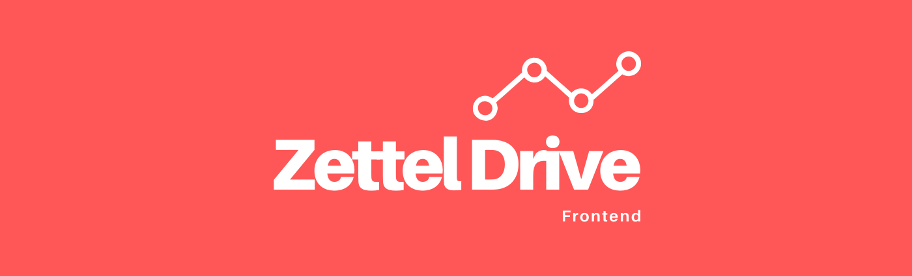

# Zettel Drive's Frontend

**Frontend of Zettel Drive app build upon Progressive Web Architecture (PWA).**

---
## Motivation
To create a no brains zettelkasten app which doesn't require you to store your "lifetime of notes" on service provider's servers.

The question that motivated this project was:
> What will happen to my notes (I spent lifetime making) if the app shuts down tomorrow?

The possible solution is to create an app with frontend only that let you interact with your notes like any traditional note taking/zettelkasten app does. All your data is therefore stored on your personal cloud, and is available to you in raw format anytime, anywhere.

## What is Zettelkasten, btw?
Zettelkasten sounds like a complicated German philosophical concept but it simply means “box of notes.” Zettelkasten is a system to manage our knowledge in form of interconnected notes.

**Further Readings:**
- [The Zettelksten Method by Less Wrong](https://www.lesswrong.com/posts/NfdHG6oHBJ8Qxc26s/the-zettelkasten-method-1)
- [How to take smart notes by Sönke Ahrens](https://takesmartnotes.com/)

## Build Status

## Code Style

**Horizontal indents:** 4 spaces.

## Tech/Framework Used

### Frameworks/Libraries

### Tech stack

## License
Apache 2.0 &copy; 2020 [Abhinay Thakur](https://thisisabhinay.com). 

[Licence File](https://github.com/zetteldrive/zetteldrive-frontend/blob/master/LICENSE)
